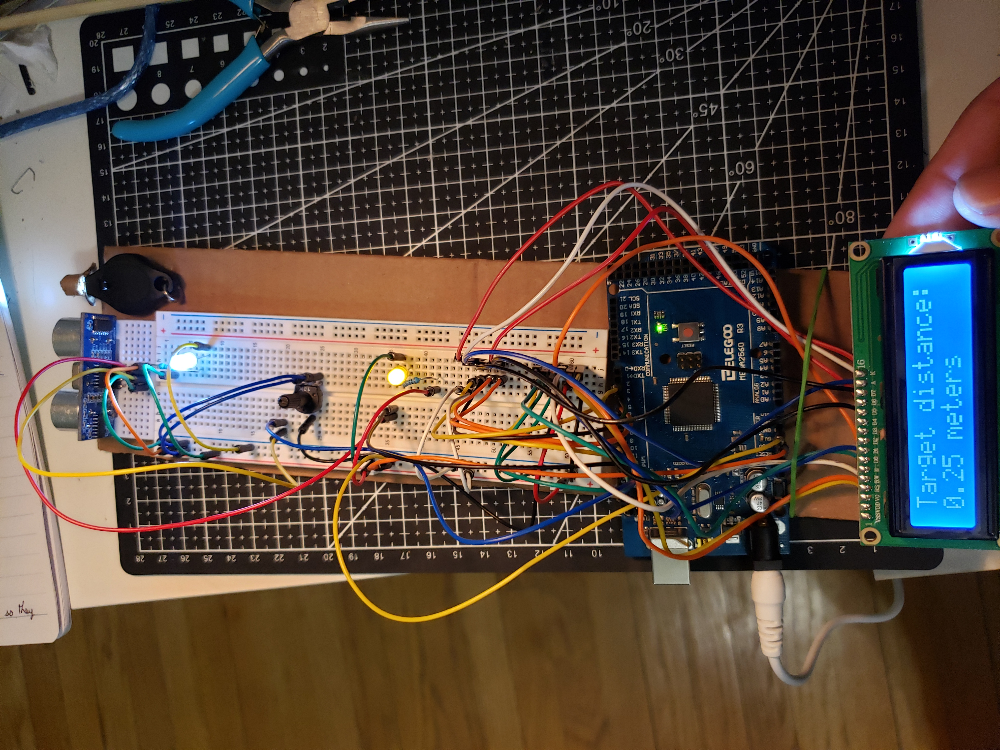

# Distance-Calculator
A distance calculator using Arduino

<html>

Material used: Arduino MEGA 2560, potentiometer, LCD, ultrasonic sensor.
 
  
The distance between the ultrasonic sensor and the object it points at is displayed on the LCD. <b>testradar.ino</b> is the program that calculates the distance.

   
Here are pictures of the system:
 
   
   
</html>
